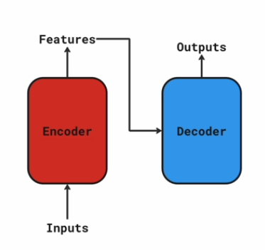
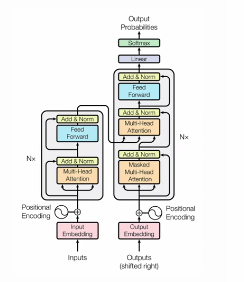
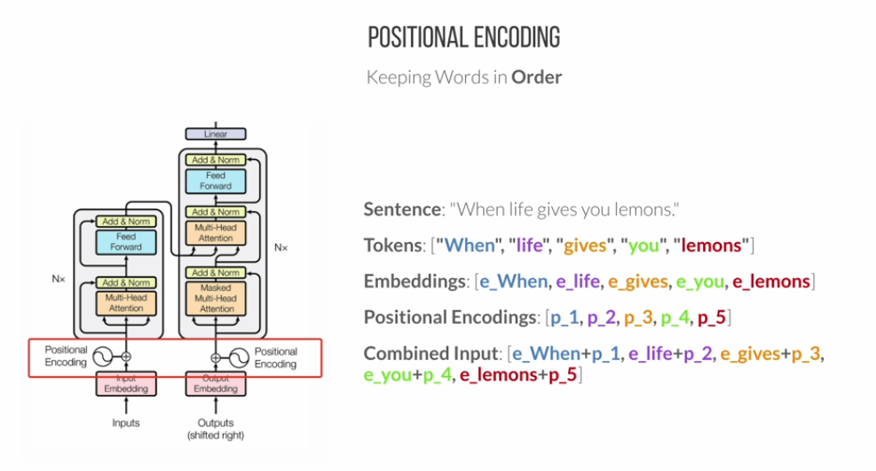
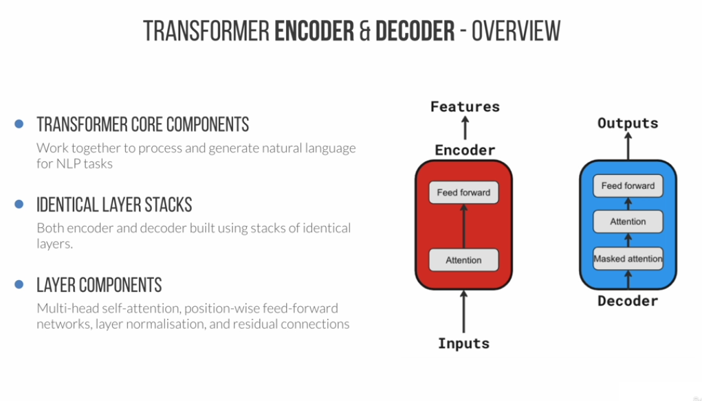
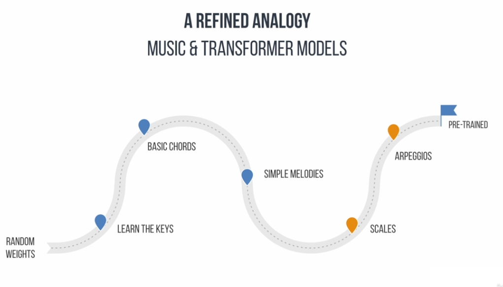
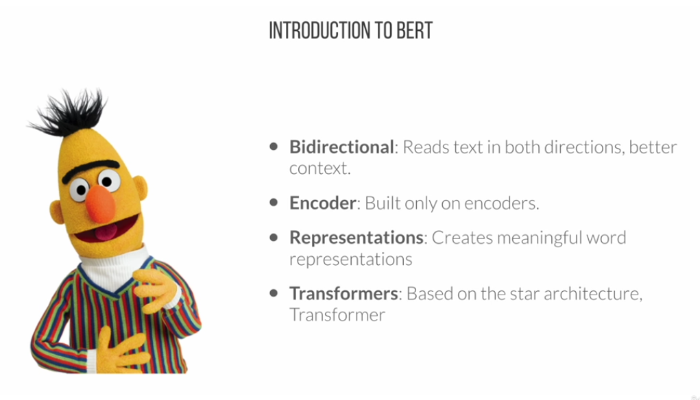
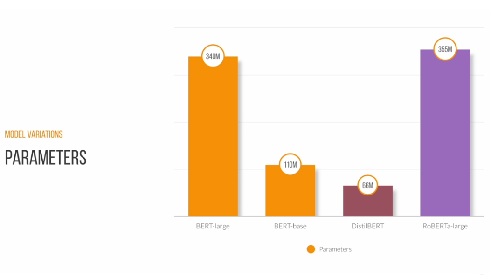

# LLM Mastery

# Project:

A simple semantic search engine that identifies and retrieves relevant paragraphs of new articles that match a query expressed in natural language.
Using all-MiniLM-L6-v2 model and cosine similarity to rank the results.

# NOTES

Eras:

- Rule-Based systems: Syntax analysis. Techiniquies: parsing and part-pf-speech tagging
- Statistical: Game changer. Data driven approaches. Probability and statistics. Better handling of language ambiguity. Using n-grams (contiguous sequences of n words) and probabilistic languague models to predict word sequences.
- Machine Learning: Learn patterns and relationships more effectively. Algorithms (Naive Bayes, Support vector machines and neural networks). Large scale data. RNNS (sequential language data) LSTM ( long short-term memory nets)
- Embeddings: Transformation in NLP, with researchers starting . Represent words as continuous vectors within a high-dimensional space, allowing models to better capture the semantic and syntatic connections between words compared to earlier techniques. Contextualised word embeddings (ELMO) give dinamic representation of each word basic on the context of the sentence.

Transformers models: Best solution we have. Self-attention mechanism, process and weigh different parts of the input. More efficient training, transfer learning

Attention: Capture relationships between elements in a sequence by assigning different importance weights. It allows focus on the most relevant parts of the input (it means understand context)

- Self-attention: weigh the importance of word-pairs
- Scaled dot-product attention: attention scores between words
- Multi-head attention: multiple heads to simultaneously capture different aspects of input data

Feed foward Networks (FNNs) are used in both enconder and decoder to learn complex, non-linear relationships between input embeddings and their context

The encoder turn words into a symphony of context and meaning

The decoder generates output text using the encoder’s continuous representation

**\*\*\*\***\*\***\*\*\*\***Training:**\*\*\*\***\*\***\*\*\*\***

Two phases of training: pre-training and fine-tuning.

Pre-training is the phase where transformer model acquires a general grasp of language structure, semantics and context from large datasets, without focusing on a specific task.

Pre-trained transformers can be fine-tuned for multiple tasks, such as switching from guitar to piano

Fine-tuning involves adjusting a pre-trained transformer model for a particular NLP task by training it on a smaller, specialised dataset. The model transitions to fine-tuning with task-specific datasets, refining its prior knowledge to specialise in a particular NLP task

**Tokenisation & Embeddings**

Tokenisation prepares raw text for transformer models by dividing it into smaller units. Connects input text to the model’s layers. Its important to handling input data, helps transformer models hadnle rare words and variations effectively

During pre-training the model learn to generates embeddings to represent different words.

\***\*\*\*\*\*\*\***\*\*\*\*\***\*\*\*\*\*\*\***Transformer Models\***\*\*\*\*\*\*\***\*\*\*\*\***\*\*\*\*\*\*\***

- **BERT**: Bidirectional encoder representations from transformers.

The goal is to understand and create meaningful text representations. Multiple layers of encoders with self-attention mechanisms. Note that decoders are not mentioned here. Bert goal’s is to understand language. Trained with the entire wikipedia words and 11.000 books.

Use cases:

- Text classification ( sentiment analysis, topic, spam detection)
- Name entity recognition (ner)
- Extractive question answering (provide a context, ask question, model extracts relevant answer from context)

- **\*\***\*\*\*\***\*\***GPT:**\*\***\*\*\*\***\*\*** generative pre-trained transformer. Different from bert in its focus on generating human-like text.

Pre-training: we pages, books, articles

Good for text-generation, machine translation, summarization

Open ai codex is a gpt-based model for code generation, autocompletion and programming assistance

- T5: Text to text transfer transformer - combine the bidirecional understanding of ebrt with text generation of gpt.

Fundamental concepts:

- Tokenizers
- Emebddings
- Attention mechanisms
- pre-trained models
